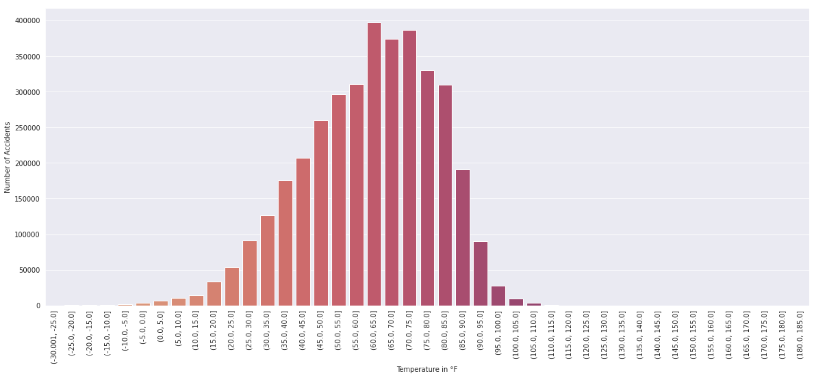
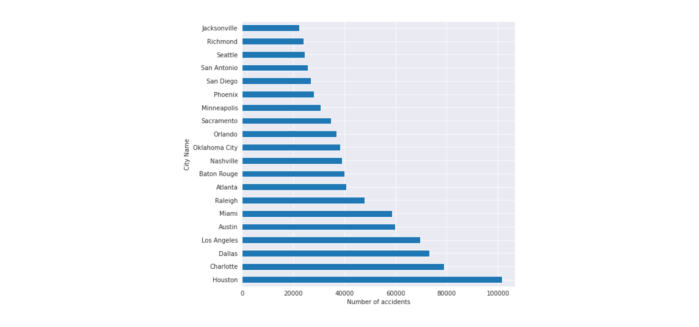
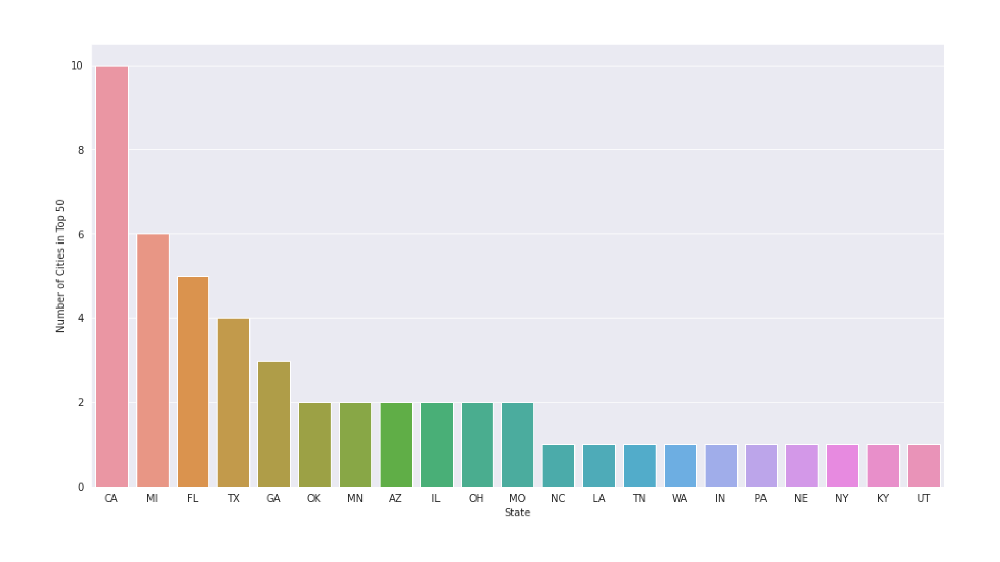
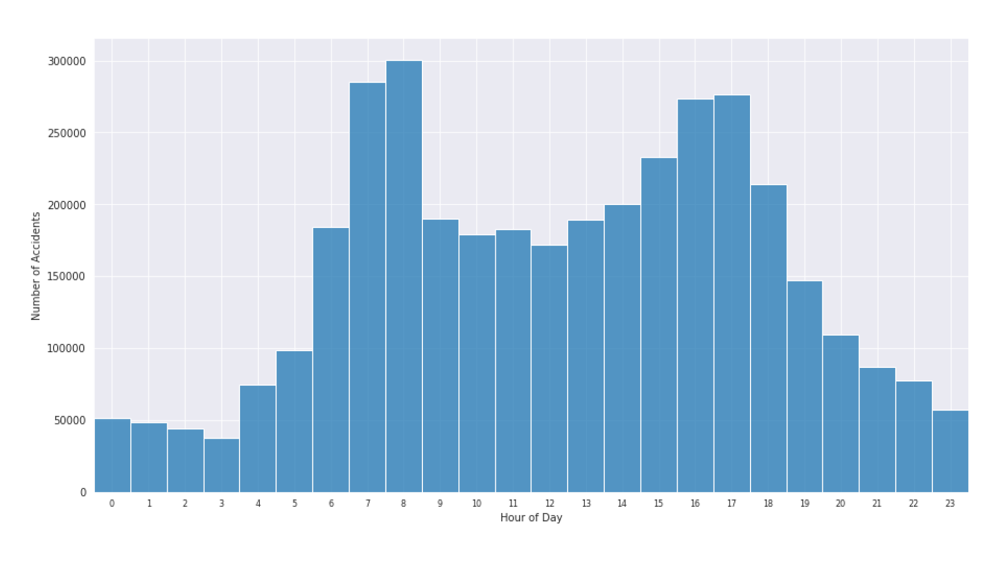
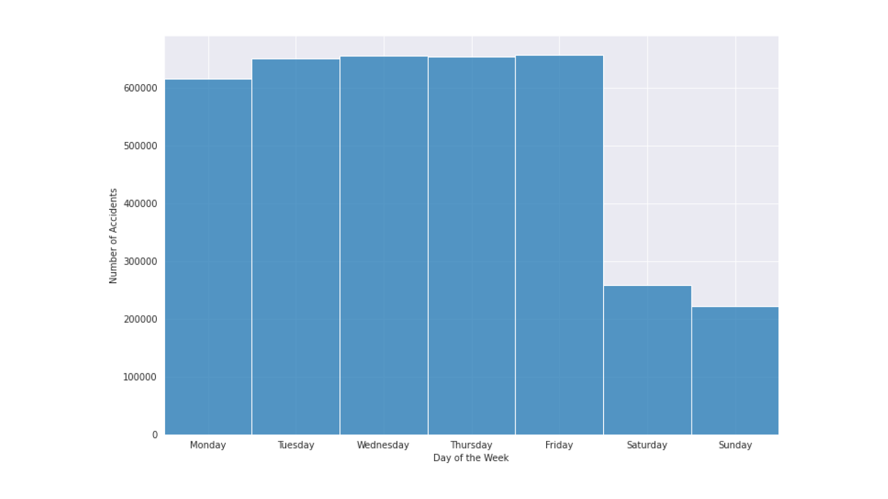
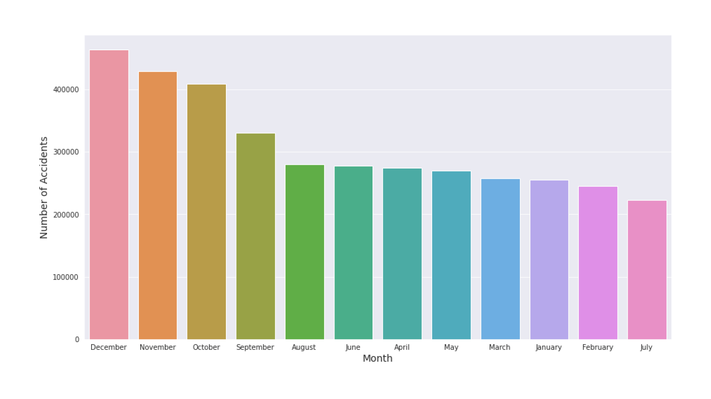
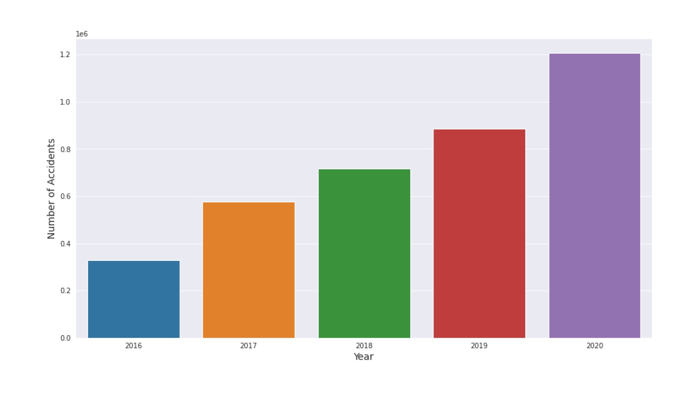

# US Accidents Data Analysis

This project analyzes the [US Accidents dataset](https://www.kaggle.com/sobhanmoosavi/us-accidents) from Kaggle. The project asks and answers a few important questions related to the location, temperature and time of an accident and tries to find a relation between them and the number of accidents.

## Contents

- [Technologies Used](#technologies-used)
- [Dataset Introduction](#dataset-introduction)
- [Dataset Processing & Cleaning](#dataset-processing--cleaning)
  - [Boolean Columns](#boolean-columns)
  - [City Data](#city-data)
  - [Zipcode Data](#zipcode-data)
  - [Cleaning the Dataset](#cleaning-the-dataset)
- [Exploratory Data Analysis & Visualization](#exploratory-data-analysis--visualization)
- [Questions & Answers](#questions--answers)
  - [Are there more accidents in warmer or colder areas?](#1-are-there-more-accidents-in-warmer-or-colder-areas)
  - [Which 5 states have the highest number of accidents?](#2-which-5-states-have-the-highest-number-of-accidents)
  - [Does New York show up in the data? If yes, why is the count lower if it is the most populated city?](#3-does-new-york-show-up-in-the-data-if-yes-why-is-the-count-lower-if-it-is-the-most-populated-city)
  - [Among the top cities in number of accidents, which states do they belong to most frequently?](#4-among-the-top-cities-in-number-of-accidents-which-states-do-they-belong-to-most-frequently)
  - [What time of the day are the accidents more frequent in?](#5-what-time-of-the-day-are-the-accidents-more-frequent-in)
  - [Which days of the week have the most accidents?](#6-which-days-of-the-week-have-the-most-accidents)
  - [Which months have the most accidents?](#7-which-months-have-the-most-accidents)
  - [What is the trend of accidents YoY (decreasing/increasing)?](#8-what-is-the-trend-of-accidents-yoy-decreasingincreasing)

## Technologies Used

| Name       | Description                                                                                                                                                                                                             |
| ---------- | ----------------------------------------------------------------------------------------------------------------------------------------------------------------------------------------------------------------------- |
| Pandas     | Pandas is a software library written for the Python programming language for data manipulation and analysis.                                                                                                            |
| NumPy      | NumPy is a library for the Python programming language, adding support for large, multi-dimensional arrays and matrices, along with a large collection of high-level mathematical functions to operate on these arrays. |
| Matplotlib | Matplotlib is a comprehensive library for creating static, animated, and interactive visualizations in Python.                                                                                                          |
| Seaborn    | Seaborn is a Python data visualization library based on matplotlib. It provides a high-level interface for drawing attractive and informative statistical graphics.                                                     |
| Folium     | Folium makes it easy to visualize data that’s been manipulated in Python on an interactive Leaflet map.                                                                                                                 |

## Dataset Introduction

This project uses the [US Accidents dataset](https://www.kaggle.com/sobhanmoosavi/us-accidents) dataset from Kaggle. It is a countrywide car accident dataset which covers 49 states of the USA. The data has been collected from **February 2016 to December 2020**. The dataset consists of **3 Million Records** and **49 Columns** which contain information about the location, date, time, severity, etc.

## Dataset Processing & Cleaning

After loading the dataset, the main task is to check for missing values. This dataset consists of 49 columns, so there are many instances of columns having many missing values. For example, 65% of the values in the `Number` column were missing. Similarly, The `Precipitation` and `Wind_Chill` columns also more than 40% missing (null) values. These columns were dropped completely. The other columns were thoroughly examined to see which data should be kept, modified or added.

### Boolean Columns

The dataset consists of 13 boolean columns. The table below represents the columns along with the percentage of True and False values in the column.

| Columns         | True %     | False % | Total Count |
| --------------- | ---------- | ------- | ----------- |
| Amenity         | 1.07926    | 98.9207 | 2906610     |
| Bump            | 0.0199201  | 99.9801 | 2906610     |
| Crossing        | 7.53211    | 92.4679 | 2906610     |
| Give_Way        | 0.282804   | 99.7172 | 2906610     |
| Junction        | 9.49825    | 90.5018 | 2906610     |
| No_Exit         | 0.132732   | 99.8673 | 2906610     |
| Railway         | 0.892001   | 99.108  | 2906610     |
| Roundabout      | 0.00488542 | 99.9951 | 2906610     |
| Station         | 1.99236    | 98.0076 | 2906610     |
| Stop            | 1.56381    | 98.4362 | 2906610     |
| Traffic_Calming | 0.0449665  | 99.955  | 2906610     |
| Traffic_Signal  | 15.608     | 84.392  | 2906610     |
| Turning_Loop    | 0          | 100     | 2906610     |

The percentage of `False` values was very high for a few columns. These columns were dropped since these can be a sign of missing data or irrelevant data.

### City Data

Some of the values for the `City` column were missing. However, because of the presence of the `Start_Lat` and the `Start_Lon` columns, the name of the city can be found. The `geopy` library was used to process the Latitude and Longitude data and to find the City names. The missing values were then filled in the dataset.

### Zipcode Data

The missing values in the `Zipcode` column were also filled using a process similar to the one used for the `City` column.

### Cleaning the Dataset

After the missing values were filled in, the unnecessary columns were dropped. The columns that were dropped are as follows -

- End_Lat
- End_Lng
- Number
- Precipitation(in)
- Wind_Chill(F)
- Bump
- Give_Way
- No_Exit
- Railway
- Roundabout
- Traffic_Calming
- Turning_Loop

Finally, all rows containing one or more null values were dropped using the `dropna()` method of the pandas library.

## Exploratory Data Analysis & Visualization

In this step, some of the most important columns were analysed in order to find a relation between the frequency of accidents in certain scenarios. The columns that were analysed closely are as follows -

- **City**
- **Start_Time**
- **State**
- **Temperature**

This analysis was performed in order to ask and answer some important questions which have been provided in the next section.

## Questions & Answers

After performing exploratory analysis of the dataset, we can ask & and answer some important questions which help us gain more clarity about the conditions when the probability of an accident occurring is high.

### 1) Are there more accidents in warmer or colder areas?

From the graph above, it seems like the number of accidents isn't greater in warmer or colder areas. Rather, it seems like the number of accidents is lower in these areas, this may be due to the lower population in these areas as most people might not live in extreme conditions.

### 2) Which 5 states have the highest number of accidents?

The top 5 states by the number of accidents are as follows -

| Rank | State              | Total Number of Accidents |
| :--- | :----------------- | :-----------------------: |
| 1.   | **California**     |          822373           |
| 2.   | **Florida**        |          339099           |
| 3.   | **Texas**          |          335865           |
| 4.   | **South Carolina** |          184625           |
| 5.   | **New York**       |          171825           |

These numbers seem to be related to the population of the state as California, Florida, Texas and New York are some of the most populous states in the US.

### 3) Does New York show up in the data? If yes, why is the count lower if it is the most populated city?

New York reported _7512_ accidents in the given time frame. This is in no way the highest number of accidents reported by any city. There could be a number of reasons for New York reported a lower number of accidents than expected.

One of the reasons may be that because of the traffic in New York, cars usually aren't traveling at a high speed so accidents can be prevented by quick reactions and evasive actions.

Another reasons could be that the dataset does not contain many accidents reports. According to the [2018 statistics](https://www.dandalaw.com/blog/are-car-accidents-common-in-new-york-city/) New York reporteed 19,000 car accidents per month. The dataset only contains a total of 7512 accidents in the time frame from February 2016 to December 2020.

### 4) Among the top cities in number of accidents, which states do they belong to most frequently?

The graph above represents the top 20 cities by number of accidents.

As we can see from the graph above, 10 out of 50 cities that contribute the highest number of accidents belong to California. The other states in the top 3 are Michigan and Florida. These top 50 cities contribute a total of **1,373,632** and this number is approximately equal to **37%** of the entire dataset!

### 5) What time of the day are the accidents more frequent in?

From the graph above, we can see that the number of accidents that happen between 6 AM and 9 AM in the morning and 3 PM and 6 PM in evening is very high. These times are often the times when most poeple go to work and leave from work. Hence, we can see that most accidents happen when people are traveling to and from work.

On further calculation, we find out that the total number of accidents happening in the peak hours between 6AM and 9AM in the morning and 3PM and 6PM in the evening is equal to **1,782,351** which amounts to **47.99%** of the entire dataset.

### 6) Which days of the week have the most accidents?

From the graph above, we can see that most accidents happen on **weekdays** i.e. from Monday to Friday. This is further proof of the initial observation that a majority of accidents occur when people are traveling to work. Since most people only work on weekdays, the number of accidents on these days is a lot higher than the number of accidents on other days.

### 7) Which months have the most accidents?

From the graph above, we can see that the holiday season contributes the highest number of accidents. This is in line with the [National Highway Traffic Safety Administration Report](https://crashstats.nhtsa.dot.gov/Api/Public/ViewPublication/812823) which states that there are generally more car crash fatalities during the holidays than non-holidays. For example, in 2017, the average amount of fatalities during major holidays was 119 per day compared to 102 per day at other times of the year.

Additionally, the report by [texasjustice.com](https://texasjustice.com/blog/why-car-accidents-increase-during-holidays/) also provides reasons for such a drastic increase in the number of accidents. Some of the reasons are:

- Increased Traffic
- Increased Drunk Driving
- Stressed, Distracted Driving
- Visiting Drivers Unfamiliar with Roads
- Dangerous Driving Conditions

### 8) What is the trend of accidents YoY (decreasing/increasing)?

From the graph above, we can see that the number of accidents appear to be increasing every year. However, this might be attributed to the way the data has been collected. This can be proven by the fact that the number of fatalities seem to be roughly the same every year as shown in this [Yearly Snapshot](https://www.iihs.org/topics/fatality-statistics/detail/yearly-snapshot) by the IIHS

## Summary & Conclusion

After performing this analysis, we can summarize the dataset from the following points -

1. A majority of accidents happen when people are traveling to work. This may be because of the higher number of cars on the road or because people are in a hurry to get to work in time.
2. Some of the biggest cities have the highest number of accidents. This may be due to the higher population in these cities which leads to an increased amount of traffic.
3. The number of accidents during the holiday season increases drastically. This may be due to various reasons such as increased traffic, increased drunk driving, dangerous driving conditions, etc.
4. The temperature of a location does not seem to have a relation with the number of accidents in that region.

We can conclude by making the following observations from this analysis of the dataset -

1. There is a high probability of an accident occurring during peak hours.
2. There is a high probability of an accident occurring during the holiday season.
3. The number of accidents may have a relation with the population of a region.
